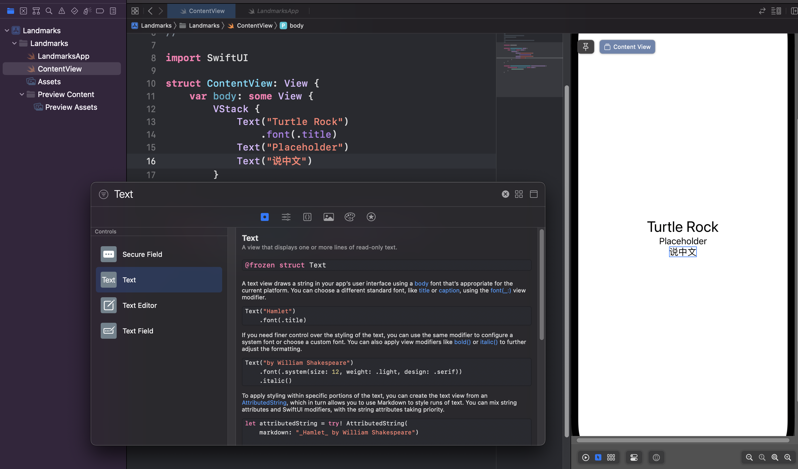
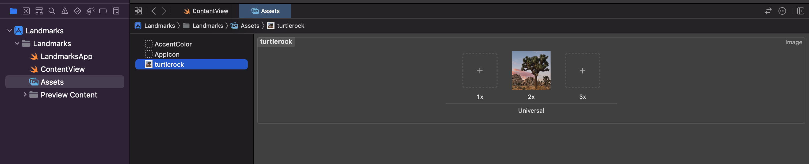

[swiftUI参考教程](https://developer.apple.com/tutorials/swiftui/creating-and-combining-views)

## 创建你的第一个项目

首先是要熟悉我们的开发环境Xcode，打开软件后，选择新建项目，我们的项目属性应该是iOS上的app，再之后为我们的新项目取上名字，就叫Landmarks，接口选择swiftUI，语言选择swift，取消勾选Include Test（简单点）。

接下来，资源管理器中就会默认生成hello world的代码，会自动在一台模拟出来的iPhone 14 Pro上输出hello world。

## 自定义文本

swift给我的第一感觉是和Java类似，类名和文件名一致，有莫名其妙的继承关系（App协议继承）。

但给人眼前一亮的是，可以直接在iPhone 14 Pro上面直接修改文字的属性，不过需要选择类似浏览器中的元素选择按钮，然后按住command，对某个元素点击后选择“展示swiftUI的检查器”，就可以修改文字格式，颜色 、甚至可以选择继承属性。

## 通过stack自定布局

还有一点是，可以按住command键点击某个函数，比如Text，然后选择一些功能，下面以嵌入 VStack为例子（应该是以栈的形式，排列指定文字）。

这时候，代码中的Text函数就被`VStack{}`包含了。

接下来比较玄幻的东西来了，在右上角有个+，在搜索框中输入Text，选择最左边的一个图标（正方形中间一个空心圆），这是个筛选功能，然后找到Text，直接拖到Text函数的下面，然后奇迹般的出现了一行代码和对应界面。更不可思议的是，你可以像组装积木一样，把刚刚的Text拖到iPhone上，也可以直接出现。在这个+里面，还可以看函数的实例用法，简直不要太方便。



上面演示的是VStack以及一些格式的设置，如果是HStack，其中包括的元素，例如Text将会是水平排布的。那么可以推测出VStack中的元素是垂直排布的。

除此之外，VStack还可以加上参数，例如

```swift
VStack(alignment: .leading) {}
```

表示对齐的格式。

HStack中的元素可以通过Spacer()进行间隔。

在VStack的花括号结束处，添加.padding()，可以让整体向内缩进，让整体更加带劲。

## 自定义图片

接下来要学的貌似没那么酷炫了，只是生成自定义的图片。

不过教程还是非常贴心的，在一开始就提供了项目文件，我们不需要自己去找那些地标图片。

插入图片的时候，是直接将图片拖进Xcode的特定位置，如下图所示：



注意是拖拽到中间黑色部分的位置。

接下来还有一些设置蒙板，比如画个圆对文本进行框选，以及为圆加上一些风格。

一个比较酷炫但有点生涩难懂的是添加地图，使用了MapKit库，状态变量和很长的接口之类的，实在是让我一直想到Java的冗长。

可以实时拖动产生的地图，或者点击画布左下方蓝色的播放符号，可以复原。我以为代码会随着用户与图片的交互而改变，但我错了。


在完成第一个文档项目后，后面要开始处理一些数据了，例如json，swift代码对我而言实在陌生，我需要使用ChatGPT和[官方swift文档](https://docs.swift.org/swift-book/documentation/the-swift-programming-language/)辅助我了解教程演示的代码。在使用官方文档的时候建议使用cmd+f来检索，而不是使用它自带的检索功能，因为检索不出来，比如guard语句。

这里的代码相比上一个项目中的图像处理更加的纯洁，我指的是字面意义上的，因为不会调用太多奇怪的库。


我解决了之前对json解析错误的bug，这次是吃了英文的亏，longitude写错了导致json解析不正确。用的是在线的文本对照器，感觉是专门为代码设计的，非常的好用，推荐一下https://www.jq22.com/textDifference